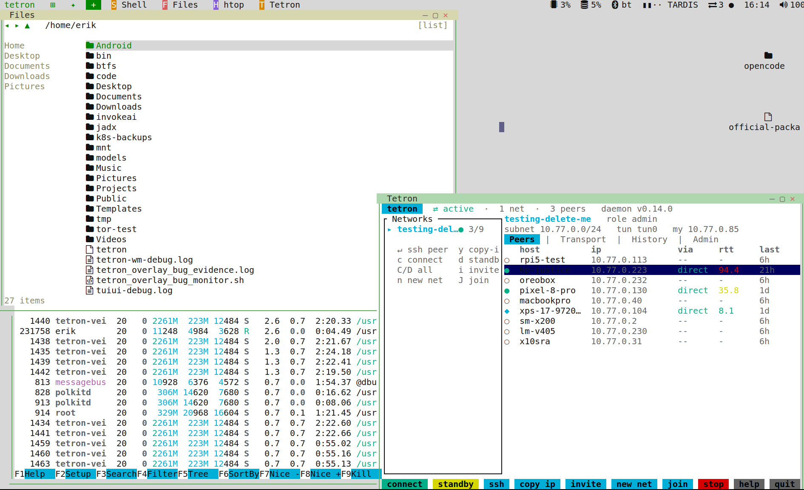

# tetron-wm

**A desktop environment for the terminal.** 

<p align="center">
  
</p>

**tetron-wm** is a windowing shell that runs *inside* a terminal: floating, overlapping windows, each hosting a real terminal application, with a mouse cursor, a top menubar carrying a taskbar of open windows + a status tray, configurable grid tiling, an app launcher, and an app store backed by the [awesome-tuis](https://github.com/rothgar/awesome-tuis) catalog.

It's a multiplexer at heart, like tmux, but with windows and a mouse: apps run as real child processes in PTYs, composited into windows, and **kept alive by a background daemon**. Detach and reattach from any terminal, or over SSH from another machine, and your whole desktop is exactly where you left it. Built from scratch in Rust.

> **Status: active development.** The shell, window management, a persistent daemon that runs apps in a **separate process so they survive a UI reload/update**, mouse passthrough into apps, an app launcher + store, a file manager, desktop icons, settings, theming, a macOS-style status tray, and configurable grid tiling all work today. GUI/Wayland streaming is on the [roadmap](docs/ROADMAP_tetron-wm.md).

###### TLDR: Install tetron-wm.

```shell
curl -fsSL https://raw.githubusercontent.com/ErikAllanKincaid/tetron-wm/main/contrib/install-tetron-wm-suite.sh | bash
```

One prompted script ([`contrib/install-tetron-wm-suite.sh`](contrib/install-tetron-wm-suite.sh)) that optionally installs, each step opt-in:

1. **tetron-wm** — the latest prebuilt binary (all OSes).
2. **config dir** — `~/.config/tetron-wm/` with a starter `config.toml` plus `themes/` and `wallpapers/` directories (all OSes).
3. **kmscon** — the truecolor + mouse console for a bare Linux VT (Linux).
4. **tty1 autologin** — boot straight into tetron-wm on tty1 via kmscon, the full console appliance (Linux + systemd; off by default, always confirmed, prints how to undo).

Steps 3–4 are for a GUI-less / console box — say no on a normal desktop. Non-interactive: add `-y` (takes the defaults: wm + config + kmscon, **not** tty1), or `--all -y` for the whole appliance. Just want the binary? Use the one-liner in [Install](#install) below.

## tetron

###### TLDR: Install the entire suite.

Install suite.

[tetron](https://github.com/ErikAllanKincaid/tetron)

```shell
curl -fsSL https://raw.githubusercontent.com/ErikAllanKincaid/tetron/main/contrib/install-tetron-suite.sh | bash
```

tetron-wm has first-class, optional support for [tetron](https://github.com/ErikAllanKincaid/tetron), the P2P mesh VPN it ships alongside in the tetron-os image (below), right in the menubar tray. The integration is self-effacing: the tray talks to the tetron daemon over its own Unix IPC socket using `tetron-proto` (the shared wire protocol, the same crate tetron-systray and tetron-webui speak), and if no daemon answers (tetron not installed, or not running) the segment simply hides. There is nothing to configure, and tetron-wm works identically with or without tetron present.

- **Status at a glance.** The tray shows `⇄<peers>` with a connection-quality dot: `●` when at least one network has a direct path, `○` when every connection is relay-only, and `off` when tetron is reachable but in standby. It is read-only, a background poll that bounds every call so a stuck daemon can never hang the tray.
- **On/off from the popover.** Click the segment for a popover with a global **Tetron [on/off]** toggle plus one row per network. Each network row toggles just that network's data plane (**Resume** / **Standby**) with its own `●`/`○` direct-or-relay indicator; the global toggle moves them all at once. These map to tetron's own `Resume`/`Standby` IPC messages, the same effect as `tetron resume` / `tetron standby` from the CLI.
- **Open terminal.** An action row at the bottom of the popover opens a terminal into tetron: it launches [`tetron-tui`](https://github.com/ErikAllanKincaid/tetron-tui) (the full-screen tetron dashboard) when that is installed, and otherwise prints `tetron status` and drops you into an interactive shell with the full `tetron` CLI. Invites and joining a network live in the cli or tetron-tui, not in the tray.

### Pairing with kmscon on a bare console

tetron-wm is the desktop layer of **tetron-os**, a GUI-less Linux that boots straight to a mouse-driven terminal desktop, reachable both at the local console and remotely over SSH/tetron. On a headless or console-only box there is no X11 or Wayland, and the kernel VT is a poor terminal: no truecolor, no real fonts, no mouse. tetron-wm pairs with **kmscon**, a KMS/DRM userspace console that renders directly on the framebuffer and provides truecolor, fontconfig fonts, XKB keyboards for every device, and the mouse-report passthrough tetron-wm needs. kmscon replaces the kernel VT as the console you land on at boot; tetron-wm runs inside it, so you get the full floating-window desktop on bare hardware with no display server at all.

**Why the maintained kmscon.** This needs the maintained line of kmscon (truecolor + mouse-report passthrough — the [Aetf](https://github.com/Aetf/kmscon) fork). On Debian it is in **trixie-backports** (packaged there as kmscon 10 + libtsm4 4.7.1); the stock kmscon older Debian/Ubuntu ship lacks the mouse support tetron-wm needs. tetron-os's `firstboot.sh` installs it and swaps the getty on the console VT for `kmsconvt@`, so the machine comes up in kmscon running tetron-wm.

To install just the kmscon pair on an existing box (handy for a truecolor VC tty even on a GUI machine), run **[`scripts/install-kmscon.sh`](scripts/install-kmscon.sh)** — it apt-installs it from backports on Debian, or builds the Aetf fork from source on Ubuntu/Mint (behind a prompt). It installs only the packages; it does not touch your getty/VT/login. To do the whole console appliance in one go (kmscon **and** the tty1 autologin), use the [suite installer](#tldr-install-tetron-wm) above with `--all`.

For the full picture — why the kernel console falls short, how the kmscon stack fits together, how the image wallpaper works on a text console, and how to make tetron-wm the persistent login on tty1 — see the illustrated walkthrough **[`docs/tetron-wm_bare_console_guide.html`](docs/tetron-wm_bare_console_guide.html)**. For the copy-paste commands (scripted and by-hand paths), see **[`docs/SETUP_tetron-wm_bare_console_kmscon.md`](docs/SETUP_tetron-wm_bare_console_kmscon.md)**.

> Over SSH you are in whatever terminal your client provides, so kmscon is not involved there; tetron-wm just runs in terminal mode. On a raw VT without kmscon, use [gpm](#mouse-on-a-bare-linux-console-gpm) for the mouse instead.

## What works today

- **Floating, overlapping windows** with drop shadows, each running a real TUI (btop, a shell, vim, …) in its own pseudo-terminal.
- **Faithful rendering** via a full terminal emulator ([`alacritty_terminal`](https://docs.rs/alacritty_terminal)), even demanding apps like btop render correctly.
- **Mouse-driven**: drag titlebars to move, drag edges to resize, click a taskbar pill to focus, click titlebar buttons to minimize/maximize/close, and **scroll the wheel** over any app window to page back through its scrollback (typing snaps back to the live bottom). The mouse also **passes through into apps** that request it (btop, yazi, lazygit, vim with `mouse=a`): clicks, drag, scroll, and modifiers, in both windowed and full-screen views.
- **Configurable grid tiling**, set a rows×columns grid (e.g. 2×3 for an ultra-wide) and use drag-to-cell snapping (with a live preview), a one-key *tile-all*, an *auto-tile* mode, or send a window straight to a numbered cell.
- **Menubar status tray**, clock + date, CPU/memory, volume, WiFi, Bluetooth, and battery (Linux sysfs / macOS `pmset`), with click-through popovers that control the **host's** volume, switch to a known WiFi network, and connect a paired Bluetooth device. Clicking the clock opens a **month calendar** (today highlighted, `◂ ▸` to browse months) that also shows your **upcoming events** and underlines their days when [`khal`](https://github.com/pimutils/khal) is installed.
- **Notifications**, when a background or minimized app rings the terminal bell, its taskbar pill gets an attention dot and a 🔔 counter appears in the tray; the popover lists who rang and when, click an entry to jump to that window. Apps that copy via **OSC 52** (vim, tmux, …) have their clipboard forwarded to your real terminal.
- **Native image viewing**, real raster images inside windows via the Kitty graphics protocol (Ghostty/Kitty/WezTerm), with a cell placeholder fallback elsewhere. Open one with a launcher entry `command = "@image"`, `args = ["~/pic.png"]`.
- **File manager**, a native, mouse-and-keyboard file browser (launcher entry **Files**, or `@files`): **icon-grid, list, and Miller-columns** views, **desktop-style icon tiles + image thumbnails** (via the Kitty graphics layer), a **preview pane** (text head / PDF text / metadata), **tabs**, **Get Info** (size, kind, Unix permissions, symlink target), folder navigation with history, single/ctrl/shift selection, new folder, rename, copy/cut/paste, and **delete-to-Trash** (never a hard delete). Double-click/Enter opens each file with its default app; **right-click an entry** for the context menu (open / rename / delete / copy / …).
- **Default Apps**, a configurable file-type → app map (**Settings → Default Apps**): images open in the built-in viewer, text/code in your `$EDITOR`, and you can cycle the handler for each role. The file manager uses it to open files "just like a real OS."
- **Desktop icons**, clickable icons on the wallpaper, merged from your live `~/Desktop` folder and pinned shortcuts, **auto-refreshing within ~2s** when something else (a terminal, the file manager) changes the folder. Double-click to open (via Default Apps), drag to rearrange (snaps to a grid, positions persisted), and right-click for a context menu (open / rename / move to Trash / new folder). Image files show thumbnails on Kitty-graphics terminals.
- **App launcher**, a Windows-95-style **cascading menu** (a one-click **Shell** quick-launch first, then categories that fly out submenus of apps on hover/arrow) *and* a Spotlight search overlay. Navigate the cascade by mouse (hover to open, click to launch) or keyboard (`↑/↓`, `→` into a submenu, `←` back, `Enter` to launch). A **`+` button** in the menubar (just right of the ✦ assistant) opens a new shell instantly. Installed catalog apps that are **CLI tools rather than TUIs** (gum, himalaya, khal, …) show a **`CLI` tag** and launch into a shell with the tool's `--help` printed first, ready to use, instead of a window that runs-and-exits.
- **App store**, browse/search/install from a curated, **100%-verified** catalog of **600+** TUIs, including a dedicated **AI** category (Claude Code, Gemini CLI, Aider, opencode, Codex, Crush, Goose, Plandex, …) and a full **terminal office suite** (word processor, spreadsheets, presentations, email, calendar, contacts, notes), OS-aware so Linux-only tools never show on macOS and vice-versa. If an app needs a toolchain you don't have (Go, Rust, Node, Python), the installer **detects it and offers to install it first**.
- **Custom apps**, add your own launcher entries (name + command) from **Settings → Apps**.
- **Working-directory picker**, launching a coding agent (Claude Code, Aider, …) opens a browsable file-tree so it starts in the project you choose; remembers recent directories. Installing Claude Code also adds a **Claude Code ⚠️** launcher variant running `--dangerously-skip-permissions`, behind a **warning dialog** so it's never launched by accident (your own `[[launcher]]` entries can set a `warn` message too).
- **Theming**, five built-in palettes (midnight, nord, gruvbox, dracula, and pastoral, a light-appearance theme), plus drop-in `*.toml` theme files in `~/.config/tetron-wm/themes/`; switchable live from **Settings → Appearance**.
- **Taskbar app-grouping + window rename**, the top menubar carries a **taskbar** of your open windows; windows of the same app collapse into one pill with a colored **letter badge** (per-app color, configurable in `[dock_badges]`); click a grouped pill to choose between its windows. Under width pressure pills shrink to badge-only and finally to a `…+N` overflow marker, so the list never collides with the tray. **Right-click a pill** for a context menu (minimise / maximise / close / reset size, Reset re-centres a stranded or mis-sized window at half the work area). **Rename** any window (double-click its **title text** or `Ctrl+Space r`), the label changes but it stays grouped with its app.
- **Simple view mode**, a top-bar toggle (`⊞` desktop ⇄ `▦` simple) that flips to a tmux-style full-screen-single-app view (no window decorations), keeping the menubar + taskbar; the taskbar is your app switcher. Same running apps in both modes.
- **Persistent daemon + thin client, with live updates** (tmux-style): apps run in a separate **apphost** process and survive client detach, SSH disconnects, **and a frontend reload**, update the binary and **reload the UI without killing your apps** (launcher → **Restart**, `tetron-wm reload`, or **Settings → Update & Reload**). Closing an app window (titlebar **✕**) asks for confirmation first since it ends the process; built-in panels (Store/Settings/Files) close without asking. `tetron-wm kill` stops everything (daemon + apphost), and works even while a client is attached.
- **Bare-console mouse (Linux)**, on a raw Linux VT with no GUI terminal, tetron-wm reads the mouse directly from the **gpm** daemon (`apt install gpm`); see [the gpm section](#mouse-on-a-bare-linux-console-gpm).
- **In-app updater**, check for and install updates from **Settings → Updates**. The default **main** channel installs the latest **prebuilt release** (a fast download, not a source recompile), reloads, and reopens Settings on the Updates screen, apps intact. A **dev** channel (toggle in the same section) tracks the dev branch from source for testing. Mouse-clickable. Updates never close your running apps, and if a future update ever required restarting the app server, a **safety dialog** warns you first and lets you save your work (with a "restart later" row in Settings → Updates).
- **Systems switcher**, hop between tetron-wm sessions on different machines from the launcher's system section (**tetron → Systems**). Saved machines show a live **●/○ reachability dot** and switch in one click over ssh; **+ Add Remote…** asks for an ssh target (+ optional password and per-system theme), then transfers your SSH key (`ssh-copy-id`, generating one if needed), installs tetron-wm on the remote (mac / Linux / WSL2) plus **gpm** for console mouse, and connects. Exiting the remote session drops you straight back into your local desktop, whose apps never stopped. Each system can carry its **own theme**, applied on attach via `TETRON_WM_THEME`. Passwords are used once for the key copy (via `sshpass`, which the installer sets up) and never saved.
- **Remote files**, every saved system gets a **Files on <name>** entry in the launcher (Systems category): browse the remote machine's disk over ssh, make/rename/trash folders, and **copy files between machines**, `Ctrl+C` in one window, `Ctrl+V` in another, and tetron-wm runs the `scp` in the background (local↔remote and remote↔remote via `scp -3`).
- **AI assistant**, the **✦** menubar button opens a persistent chat panel (or a floating window, pick in **Settings → Assistant**) running **[opencode](https://opencode.ai)**: one model-agnostic (Claude / GPT / Gemini / local via Ollama), MCP-extensible CLI rather than a menu of frameworks. The agent's instructions live in the repo's [`agent/`](agent/) pack, embedded in the binary and stamped as `AGENTS.md` into `~/.local/share/tetron-wm/assistant/` on every launch (the convention opencode reads), and that folder is forced as the agent's cwd. The briefing covers its role, the desktop-control CLI (`tetron-wm launch/tile/theme/msg`), the logs, the repo (so it can fix bugs and open PRs), **and all your saved systems**, so the agent can ssh/scp across your machines ("get that file from my ubuntu box onto this desktop") with the keys Add Remote already installed; the systems list is synced to remotes during setup so the assistant knows the same machines everywhere. The chat survives detach and reloads; install opencode from the Store with setup tips shown in the detail pane. Want broader OS/computer-use control? Add an MCP server in opencode's config, the panel inherits it. **Switch the agent between opencode and hermes in Settings → Assistant** (or point the panel at any other binary via `assistant_command` in config.toml).
- **Logs viewer**, launcher → **tetron-wm → Logs** opens a live view of `~/tetron-wm-debug.log` (logging is always on): scroll with `↑/↓/PgUp/PgDn` or the wheel, press **`c` to copy the log to your terminal's clipboard** (OSC 52, works in Ghostty/Kitty/WezTerm, even over ssh), `r` to refresh. Perfect for pasting into a bug report.

## Controls

tetron-wm uses a **leader key** (`Ctrl+Space`) so its shortcuts never collide with macOS, your terminal, or the focused app. Press the leader, release, then a key:

| Shortcut                    | Action                                                             |
| --------------------------- | ------------------------------------------------------------------ |
| `Ctrl+Space` then `Space`   | Spotlight launcher (type to filter, ↑/↓, Enter)                    |
| `Ctrl+Space` then `a`       | App menu (dropdown)                                                |
| `Ctrl+Space` then `m` / `n` | Maximize / minimize focused window                                 |
| `Ctrl+Space` then `[` / `]` | Snap focused window left / right half                              |
| `Ctrl+Space` then `t`       | Tile all windows into the grid                                     |
| `Ctrl+Space` then `T`       | Toggle auto-tile mode                                              |
| `Ctrl+Space` then `1`–`9`   | Send focused window to grid cell N                                 |
| `Ctrl+Space` then `s` / `,` | Open the Store / Settings                                          |
| `Ctrl+Space` then `A`       | **Activity Monitor**, see and kill hosted apps                     |
| `Ctrl+Space` then `r`       | **Rename** the focused window (type a new name, Enter)             |
| `Ctrl+Space` then `?`       | **Help**, show this shortcut cheatsheet in-app (any key dismisses) |
| `Ctrl+Space` then `q`       | Detach (apps keep running in the background)                       |

Exit/Restart/Shutdown/Systems live at the bottom of the **launcher** (click **tetron**, top-left): **Exit** detaches, **Restart** reloads the UI keeping apps alive, **Shutdown** stops everything. **Systems** cascades the machine switcher: click a saved machine to ssh into its tetron-wm session (its `✕` opens a confirm, with an opt-in toggle to also revoke this PC's SSH key on that host), or **+ Add Remote…** to set up a new one (Tab/↑↓ between fields, `←`/`→` picks the theme, Enter connects). Setup also copies your terminal's **terminfo** to the remote (so Ghostty/Kitty `TERM`s like `xterm-ghostty` don't break curses apps there, with an automatic `xterm-256color` fallback on every connect) and syncs your saved-systems list. Troubleshooting a switch: every step logs to `~/tetron-wm-debug.log` (open it in-app via launcher → tetron-wm → **Logs**, press `c` to copy it); `TETRON_WM_DEBUG=1` additionally prints the exact ssh/setup script before it runs.

Forget a shortcut? Press **`Ctrl+Space` then `?`** for the in-app cheatsheet.

Set the grid (rows × columns), gap, and auto-tile from **Settings → Windows**.

In the **working-directory picker** (opens when launching a coding agent): `↑`/`↓` to move, `→`/`←` to expand/collapse, `n` to make a new folder, `.` to toggle hidden dirs, `Enter` to open there, `Esc` to cancel.

In the **file manager** (launcher → **Files**): `↑`/`↓`/`←`/`→` move the cursor, `Enter` opens (folder → navigate, file → default app), `Backspace` goes up, `Ctrl+C`/`Ctrl+X`/`Ctrl+V` copy/cut/paste, `Delete` moves to Trash (with confirm), `F2` renames, `Ctrl+N` makes a new folder, `1`/`2`/`3` switch icon/list/columns views, `Space` toggles the preview pane, `.` toggles hidden files, `Esc` closes. **Tabs:** `Ctrl+T` new, `Ctrl+W` close, `Tab` switch. **Get Info** (size, kind, Unix permissions, symlink target) is on the context menu. Click an entry to select, the toolbar `◂ ▸ ▲` to navigate, and the scroll wheel to move through long folders. Image folders show **thumbnails** in icon view on terminals with the Kitty graphics protocol.

On the **desktop** (the empty wallpaper): click an icon to select, **double-click to open** (folders → the file manager, files → their default app, pins → the app), **drag** an icon to rearrange it (snaps to a grid, position saved), and **right-click** an icon (open / rename / move to Trash) or the empty desktop (new folder / clean up). Icons come from your `~/Desktop` folder plus pinned shortcuts.

Mouse: click **tetron** (top-left) for the app launcher (Exit/Restart/Shutdown/Systems are at its bottom), the **`⊞`/`▦`** toggle (next to it) to switch desktop/simple view, **✦** to open/hide the AI assistant panel, the **`+`** (just right of ✦) to open a new shell, titlebar buttons (`– ▢ ✕`), and **double-click a window's title text to rename** it. Drag titlebars/edges to move/resize, drag a window to a screen edge to snap it into a grid cell, click a tray indicator (clock/volume/WiFi/…) for its popover, and click taskbar pills to focus (a grouped pill opens a chooser) or **right-click a pill** for its context menu (minimise / maximise / close / reset size). Scroll the wheel over a shell/app window to read its scrollback, or over the far-right **volume** segment to change the system volume. The mouse passes through into apps that enable mouse reporting.

## Build & run

Requires a [Rust toolchain](https://rustup.rs).

### Install

> Install from **`ErikAllanKincaid/tetron-wm`** (below). It installs as `tetron-wm`, its own binary, config dir, state dir, and service, so it never collides with anything else on your `PATH`.

**Prebuilt binary** (macOS arm64/x86_64, Linux x86_64/aarch64, no Rust needed):

```bash
curl -fsSL https://raw.githubusercontent.com/ErikAllanKincaid/tetron-wm/main/install.sh | sh
```

**Or build from source** with a [Rust toolchain](https://rustup.rs):

```bash
cargo install --git https://github.com/ErikAllanKincaid/tetron-wm
```

Either way the `tetron-wm` binary lands on your `PATH`, so you can just run:

```bash
tetron-wm            # start the daemon (if needed) and attach
```

Update later from inside the app (**Settings → Updates → Check / Update**), or manually:

```bash
cargo install --git https://github.com/ErikAllanKincaid/tetron-wm --force
tetron-wm kill && tetron-wm     # restart the daemon onto the new build
```

### Run from a clone (for development)

```bash
cargo run --release        # starts the daemon (if needed) and attaches a client
```

tetron-wm runs as a **persistent daemon + thin client** (like tmux): the daemon owns
your windows and processes and keeps them alive, while the client renders to your
terminal. Detaching, or an SSH disconnect, leaves everything running; reattach
and it's all still there.

```bash
tetron-wm            # ensure the daemon is running, then attach
tetron-wm attach     # attach to an already-running daemon
tetron-wm reload     # restart the UI only; apps keep running
tetron-wm ps         # list every hosted app (id, pid, cmd, age, alive)
tetron-wm kill-app <id|all>  # kill one (or every) hosted app
tetron-wm kill       # shut the daemon down (closes all windows)

# Control a running desktop from any shell (also how the AI assistant drives it):
tetron-wm launch btop          # open a new window running btop
tetron-wm tile                 # tile all windows into the grid
tetron-wm theme nord           # switch theme
tetron-wm msg '"MaximizeFocused"'   # raw control message (ClientMsg JSON)
```

Detach with **`Ctrl+Space` then `q`** (apps keep running); to fully stop, **shut
down** from the bottom of the launcher (click **tetron**), `tetron-wm kill`, or
`Ctrl+Space` then `Q`. That same launcher section also has **Restart** (reload the
UI, apps stay alive, see *live updates* above). The socket lives in a per-user
`0700` directory (`$XDG_RUNTIME_DIR` or the temp dir).

Configuration lives at `~/.config/tetron-wm/config.toml` (see [example below](#configuration)). On first run with no config, tetron-wm opens your `$SHELL` and auto-detects installed TUIs.

### Recommended terminal

tetron-wm wants a **truecolor, mouse-capable terminal**: **Ghostty**, Kitty, WezTerm, or iTerm2. Avoid macOS Terminal.app (weak truecolor + flaky mouse). Inline images (image viewer, file-manager thumbnails, desktop icon tiles) need a terminal that speaks the **Kitty graphics protocol** (Ghostty/Kitty/WezTerm); without it those fall back to text glyphs.

This works over SSH too: your **local** terminal emulator does the mouse + graphics reporting, so a headless remote box needs nothing special, the emulator on the machine you're sitting at sends the events.

### Mouse on a bare Linux console (gpm)

If you run tetron-wm **directly on a bare Linux virtual console**, no X/Wayland, just a shell on a TTY (locally, or after SSHing into a headless box and dropping to its console), the kernel console emits no terminal mouse sequences. Install **gpm** (the General Purpose Mouse daemon) and tetron-wm will talk to it directly for full mouse support:

```bash
sudo apt install gpm        # Debian/Ubuntu (use your distro's package elsewhere)
# make sure the gpm service is running on the console, then launch tetron-wm
```

tetron-wm auto-detects the console and connects to gpm's socket, no config needed (`TETRON_WM_GPM=0` disables it, `TETRON_WM_GPM=1` forces an attempt). It speaks gpm's socket protocol directly (no `libgpm` linkage), so it stays MIT-clean. Recommended for anyone running tetron-wm on a Linux shell without a desktop. Note: a bare console still can't display the inline image tiles (those need a Kitty-graphics terminal); windows, the taskbar, the launcher, and the mouse all work.

### Run the apphost as a service

The **apphost** (the process that owns your running apps) is normally spawned on
demand and kept alive across frontend reloads/detaches. To have it **auto-start on
login and restart if it crashes**, so your apps are always waiting for you, install
it as a per-user service:

```bash
tetron-wm service install      # set up + start the apphost service for this platform
tetron-wm service status       # show the backend, whether it's installed/running
tetron-wm service uninstall    # stop + remove it
```

Per platform (chosen automatically):

- **macOS** → a launchd **LaunchAgent** (`~/Library/LaunchAgents/tetron-wm-apphost.plist`).
  Because it runs inside your GUI login session, the apphost gets **Keychain access**,
  which also lets tools like the Claude Code CLI stay logged in when run inside tetron-wm.
- **Linux / WSL with systemd** → a `systemctl --user` unit (`tetron-wm-apphost.service`).
  Tip: `loginctl enable-linger $USER` keeps it running across logout.
- **Old WSL / minimal distros (no user systemd)** → a guarded block appended to
  `~/.profile` that starts the apphost on login (best-effort; no crash supervision).

The installer bakes your current `PATH`/`HOME`/`SHELL`/`LANG` into the service so it
can find and launch your apps, re-run `tetron-wm service install` to refresh them. The
apphost is idempotent: a redundant start (service + the daemon's on-demand spawn)
exits cleanly instead of fighting over the socket.

### Current development setup

This project is currently developed and tested on **macOS** using **[Ghostty](https://ghostty.org)**, frequently driving a tetron-wm instance **running on a remote machine over SSH** (the Mac is the thin client; tetron-wm and the apps run on the host). Two things matter in that setup:

- **Truecolor over SSH:** SSH doesn't forward `COLORTERM`, so export it on the host before launching for full 24-bit color (otherwise tetron-wm falls back to a 256-color approximation):
  
  ```bash
  export COLORTERM=truecolor
  cargo run --release
  ```

- **Terminfo over SSH:** if `clear`/apps complain about an unknown `xterm-ghostty` terminal, install Ghostty's terminfo on the host once:
  
  ```bash
  infocmp -x xterm-ghostty | ssh user@host -- tic -x -
  ```

Persistent remote sessions work today: the daemon + apphost run on the host and keep your apps alive, so you can SSH in, `tetron-wm attach`, detach (or just drop the connection), and reattach later, from the same terminal, a different one, or another machine, and find everything exactly where you left it.

## Configuration

```toml
# Values below are the defaults; override only what you want to change.
snapping_enabled = false  # drag-to-cell snapping
snap_threshold = 3        # edge band (cells) that engages snapping
window_shadows = false
theme = "nord"            # midnight | nord | gruvbox | dracula | pastoral | <theme-file name>
# theme_dir = "themes"    # *.toml theme files; default <config>/themes/

# Terminal colors, independent of the desktop theme (hex or named color).
# Unset = follow the theme (e.g. "pastoral" = black-on-white terminals). Set to
# decouple, e.g. a light desktop with a dark terminal. Applied at apphost start.
# truecolor = true        # force 24-bit color if your terminal does truecolor
#                         # but omits COLORTERM (env: TETRON_WM_TRUECOLOR=1/0)
# terminal_bg = "#ffffff"
# terminal_fg = "#1a1a1a"

# File-type icon glyphs where the graphical (Kitty) icons can't render (kmscon,
# a bare VT, plain SSH): ascii (default, renders everywhere) | nerd | emoji.
# icon_style = "ascii"

# Wallpaper (also editable in Settings → Appearance). Rendered to cells via chafa,
# so it works on any terminal incl. a kmscon console. A path relative to the config
# dir resolves under ~/.config/tetron-wm/wallpapers/ (a bare filename lives there);
# absolute and ~ paths also work. Env TETRON_WM_WALLPAPER=<path> overrides.
wallpaper = "wallpaper.jpg"   # drop an image in ~/.config/tetron-wm/wallpapers/
wallpaper_enabled = true      # master on/off for the wallpaper
# desktop_scrim = "none"      # backing behind icon labels over a wallpaper:
#                             # a color (#rrggbb[aa] / named), or "none"/"off".
#                             # Unset = a semi-transparent black (#000000c8).

# AI assistant (the ✦ menubar button; also editable in Settings → Assistant)
# assistant_command = "opencode"   # the agent CLI: "opencode" or "hermes"
#                                  # (switch in Settings → Assistant), or any binary
# assistant_args = ["--model", "anthropic/claude-sonnet-4-6"]  # extra CLI args
assistant_mode = "panel"  # "panel" (right-docked) | "window" (floating)

# In-app updater (Settings → Updates)
update_branch = "main"    # "main" = fast prebuilt releases; "dev" = build from source

# Tiling grid (also editable in Settings → Windows)
grid_rows = 2
grid_cols = 3
tile_gap = 0
auto_tile = false
launch_maximized = false  # true = new windows open maximized (Settings → Windows)

# Working-directory picker (for coding agents flagged requires_cwd)
default_project_dir = "~/Development"   # picker opens here (default: ~)

# Desktop icons (~/Desktop + pins), no Settings toggle yet, config-only
desktop_enabled = true

# File-type → app handlers (also editable in Settings → Default Apps)
[default_apps]
image = "@image"

# Auto-started at launch (and shown in the taskbar)
[[apps]]
name = "btop"
command = "btop"
[[apps]]
name = "shell"
command = "zsh"

# Extra apps offered in the launcher (installed TUIs are auto-added).
# Also addable from Settings → Apps.
[[launcher]]
name = "lazygit"
command = "lazygit"
category = "Git"

# Taskbar app-badge colors: keyword (matched in the app name/command) → color
# (a named color or #rrggbb). Unlisted apps get a stable color hashed from
# their name. The badge is the app's initial; renamed windows keep it.
[dock_badges]
claude = "orange"
kilo = "yellow"
```

Most of these are editable live from the in-app **Settings** panel, which writes this file back.

## Architecture

A pure-logic core (geometry, cell compositor, window manager, input routing) wrapped by I/O adapters (a `crossterm` terminal backend, a `portable-pty` + `alacritty_terminal` process host). A `SessionCore` owns the windows and apps and talks to the front-end through a `ClientMsg`/`Frame` boundary that **crosses a Unix socket**: the daemon serves a thin client over it (the thing you attach), and the apps themselves live in a separate **apphost** process behind a second socket, so they survive a frontend reload/restart.

Design docs and the slice-by-slice plan live in [`docs/superpowers/`](docs/superpowers/).

## Roadmap

What works today is listed above. The full shipped-vs-planned roadmap, including
the upcoming GUI/Wayland mode and the standalone "TUI-OS" app, lives in
[`docs/ROADMAP_tetron-wm.md`](docs/ROADMAP_tetron-wm.md).

## Credits

The app catalog is generated from [rothgar/awesome-tuis](https://github.com/rothgar/awesome-tuis) via `scripts/gen_catalog.py`. tetron-wm stands on the shoulders of `alacritty_terminal`, `crossterm`, and `portable-pty`.

## License

**[MIT](LICENSE)** © 2026 [JAN LABS LTD](https://janlabs.co.uk). Use, modify, and
distribute freely, including commercially, provided the copyright notice and
license text are retained.

tetron-wm's dependencies are permissive (MIT / Apache-2.0 / BSD / Zlib / Unlicense, plus
one MPL-2.0 crate used unmodified); their notices are collected in
[THIRD-PARTY-LICENSES.md](THIRD-PARTY-LICENSES.md).
